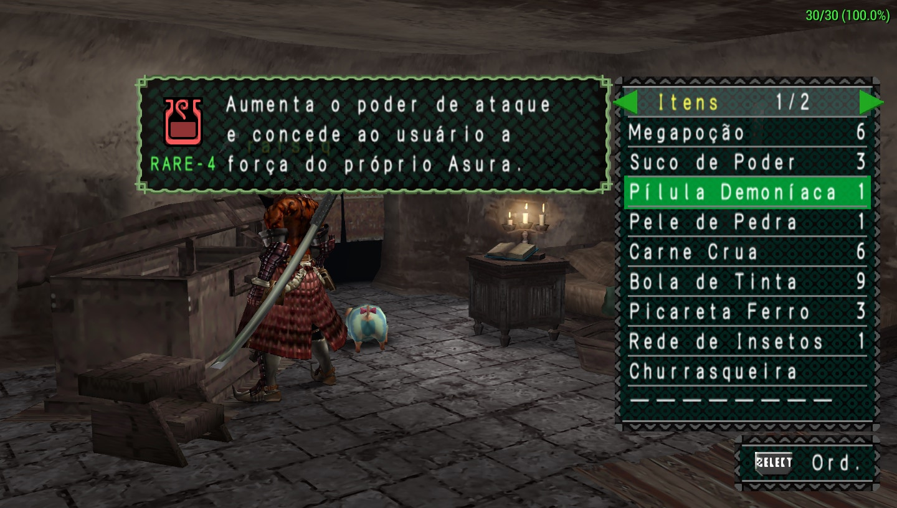
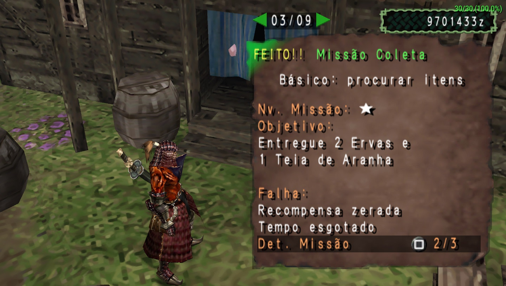
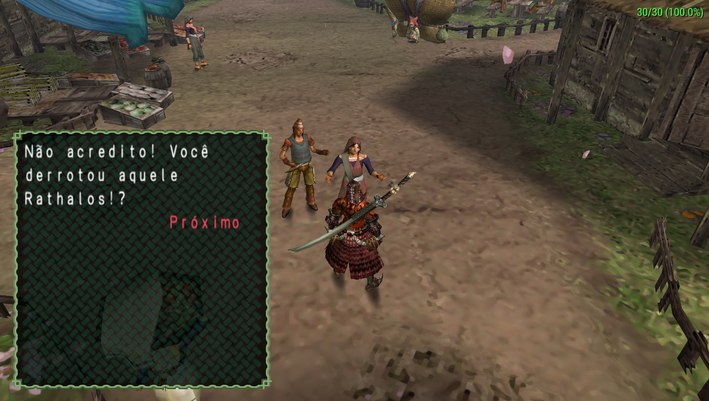
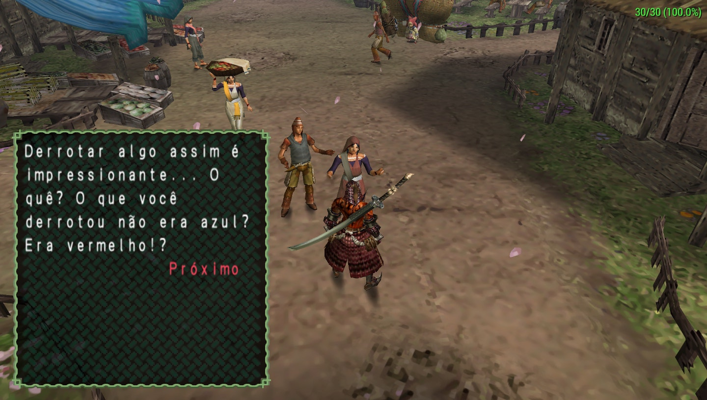

# Monster Hunter Freedom — Tradução PT-BR

Patch de tradução não oficial de **Monster Hunter Freedom** para português do Brasil.

Esta distribuição contém somente as diferenças produzidas pela tradução. Nenhuma ISO, ROM ou outro arquivo completo do jogo é fornecido.

A tradução foi desenvolvida tomando como referência as traduções oficiais em português do Brasil dos jogos mais recentes da série *Monster Hunter*. Nomes, termos recorrentes e escolhas de estilo foram alinhados, sempre que possível, à terminologia oficial moderna, com adaptações para o contexto e as limitações do primeiro *Monster Hunter Freedom*.

## Imagens da tradução

<p align="center">
  
  
</p>

<p align="center">
  
  
</p>

<p align="center">
  
</p>

## Versão pública

**v1.0**, publicada em 14/09/2026.

## Requisitos

- Uma cópia própria da edição europeia de *Monster Hunter Freedom* para PSP, versão 1.01.
- Um programa compatível com patches Xdelta 3, obtido pelo próprio usuário.
- Aproximadamente 750 MB livres para a nova ISO.

O aplicador aceita exclusivamente esta imagem de origem:

| Propriedade | Valor |
| --- | --- |
| Edição | Europe (En,Fr,De,Es,It), v1.01 |
| Tamanho | 749.699.072 bytes |
| SHA-256 | `eb0a5b6aff18688df544126e1a1e2480a1742fb48db74a1e64573d43073d1f17` |

Outras regiões, versões, imagens modificadas ou arquivos compactados não são compatíveis.

## Como instalar

1. Baixe `Monster-Hunter-Freedom-PTBR-v1.0.xdelta` na página da Release v1.0.
2. Instale ou baixe um aplicador compatível com Xdelta 3.
3. Selecione sua ISO europeia v1.01 como arquivo de origem.
4. Selecione o arquivo `.xdelta` baixado como patch.
5. Escolha `Monster Hunter Freedom (PT-BR) (v1.0).iso` como arquivo de saída.

Na ferramenta de linha de comando `xdelta3`, o equivalente é:

```text
xdelta3 -d -s "Monster Hunter Freedom (Europe) (En,Fr,De,Es,It) (v1.01).iso" "Monster-Hunter-Freedom-PTBR-v1.0.xdelta" "Monster Hunter Freedom (PT-BR) (v1.0).iso"
```

Confirme os hashes informados abaixo antes de jogar. Preserve a ISO original.

## Resultado esperado

| Propriedade | Valor |
| --- | --- |
| Nome | `Monster Hunter Freedom (PT-BR) (v1.0).iso` |
| Tamanho | 750.166.016 bytes |
| SHA-256 | `3ae3261ac95ba8f25219740ee4054ed3bea2bf4a63a7cfacc8287ba5d80c9854` |

O patch `.xdelta` possui SHA-256 `c4c0bf1ca9a4ae1be700619ec1063ded9e671dd741c47f58c9531458b01d1db8`.

## Conteúdo da tradução

- textos principais, menus, itens, equipamentos e descrições;
- missões, objetivos, falhas, resultados e eventos;
- tutoriais, artigos e ajuda;
- diálogos de NPCs de Kokoto;
- padronização terminológica em português do Brasil.

Antes da montagem da versão pública, as 7.400 entradas do bloco principal, 1.399 falas de NPCs e os 5.874 blocos internos da imagem foram verificados. O patch também foi aplicado novamente à ISO original e o resultado foi confirmado pelo SHA-256.

## Problemas conhecidos

A estrutura e o conteúdo passaram pelas verificações automatizadas. A revisão visual completa no PPSSPP ainda está em andamento; podem existir textos longos, quebras de linha ou caracteres que precisem de ajustes de apresentação.

Ao encontrar um problema, abra uma issue e informe o local do jogo, o texto exibido, o texto esperado e, se possível, inclua uma captura de tela.

# Aviso legal

Este é um projeto de fãs, gratuito e sem fins lucrativos. Não possui vínculo, autorização ou associação com Capcom, Sony Interactive Entertainment ou qualquer outra detentora de direitos relacionada ao jogo.

*Monster Hunter*, seus nomes, marcas, personagens, imagens e demais elementos pertencem aos respectivos titulares. Este repositório e seus pacotes de distribuição não contêm a ISO completa do jogo.

O patch deve ser aplicado somente a uma cópia obtida legalmente pelo próprio usuário. Não solicite nem compartilhe links para ISOs, ROMs ou outros conteúdos protegidos nas issues, discussões ou demais canais do projeto.

Nenhum executável de aplicação é incluído. O usuário é responsável por obter uma ferramenta compatível com Xdelta 3 de uma fonte de sua confiança.
